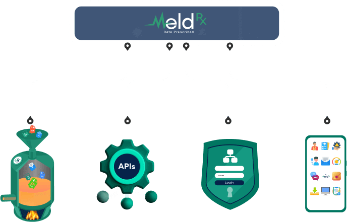

Getting Started
===============

Test Images (TODO: Put this here because otherwise Sphinx wouldn't include them)
-------------

To get started with the BlueButtonPRO platform, you must first contact our sales department. During
that process, they will have created a new organization for you and will have created a user account
that will be listed as the administrator of that organization. A FHIR server will also be provisioned
for this organization. This data will be created in our sandbox environment. An
account and one or more organizations may also be provisioned for you in our production environment
by our sales team. However, use of the production environment will need approval. Refer to the :ref:`getting-started-production-submit-for-review`
section for more information. You will typically test and play around with our platform in the sandbox
environment and then move to production once sandbox testing has been completed.

.. _getting-started-smart-on-fhir:

SMART-on-FHIR
-------------

We follow the `SMART-on-FHIR <http://docs.smarthealthit.org/>`_ specification. The applications that
are registered here are considered SMART apps. These applications must follow the application launch
guidelines specified in `SMART App Launch Framework <http://hl7.org/fhir/smart-app-launch/index.html>`_.

We also implement the bulk export specification described in the `FHIR Bulk Data Access Implementation
Guide <https://hl7.org/fhir/uv/bulkdata/index.html>`_. An application cannot both be a standalone or
EHR launch application type and also be a bulk export application. Separate applications will need to
be created for those scenarios.

Creating an Application
-----------------------

Once the initial setup is complete with our sales team, you will now need to create an application/client
that will interact with the BlueButtonPRO API. We have built a UI to make this process easier and is
available at https://developer.darenasolutions.com.

Once you have navigated to that site and logged in with your new sandbox account, you should be at the
home page where it lists all of your existing applications. There shouldn't be any there at this time.
Click on the **+** button on the top of the page to add a new application:

This will open up the editor where you enter in the information about your application.

Basic Information
^^^^^^^^^^^^^^^^^

Client Name - **REQUIRED**
   This is the human readable client name and will be displayed to all of your users in the consent
   screen when they log in.

Client URI
   This is a URL for your application. Generally, we recommend this to be the URL to the homepage of
   a site that describes your application and its capabilities.

Logo URI
   This is the URL that contains the logo for your application. This will be displayed on the consent
   screen. If a logo is not provided, only the client name is displayed in the consent screen.

Registration Type
   The type of application you are creating. These follow the :ref:`SMART-on-FHIR <getting-started-smart-on-fhir>`
   application types. You can select the Standalone/EHR launch application type, or bulk export application
   type.

Client Type
   The client type is determined by how your application is hosted and what kind of application it is.
   If your application is a javascript, mobile, or desktop application, then the source code is available
   and accessible by the user. This type of application is a **Public** application.

   If the client is a web application where the source code is hosted on a server and not accessible
   by users, then this type of application is a **Private** application. In this situation, a client
   secret will be generated for the application.

   If the registration type is **Bulk Export**, then this option is not displayed.

JWKs URL
   This value is only applicable for bulk export applications. In this case, a URL to your JSON Web
   Keys is required. We use this URL to retrieve the public key that validates the JWT token provided
   by the application when retrieving an access token for bulk export. This process is described in
   the `SMART Backend Services <https://hl7.org/fhir/uv/bulkdata/authorization/index.html>`_ document.

Redirect URLs
^^^^^^^^^^^^^

Add one or more redirect URLs for the application here. This is where the server will redirect to with
authentication/authorization details.

Only a maximum of 5 redirect URLs are supported.

Post Logout Redirect URLs
^^^^^^^^^^^^^^^^^^^^^^^^^

Add one or more post logout redirect URLs for the application here. The application can perform a logout
process by interacting with our end session endpoint: https://oauth.darenasolutions.com/connect/endsession.
If the user is successfully logged out and a post logout URL is provided, then our identity provider
will redirect the user to that post logout URL.

For more information on how the logout process works, refer to the `OpenID Connect Specification <https://openid.net/specs/openid-connect-rpinitiated-1_0.html>`_.

Only a maximum of 5 post logout URLs are supported.

Finalizing
^^^^^^^^^^

Once the information has been entered into the editor, click on the **OK** button and your application
should now be created. If your application type was a **Private** application, then you should also
see a popup that contains your client secret. It is important that you take this secret and store it
in a secure location. Once the popup is closed, this secret can no longer be obtained. If the secret
is lost or forgotten, a new secret will need to be generated.

At this point, your application can begin using the BlueButtonPRO API in the sandbox environment.
The homepage should be updated to reflect that you have added an application, and your client ID should
be visible. You must use this client id to authenticate with our identity provider.

Dynamic Registration
--------------------

The process for creating an application with the UI follows the `dynamic registration specification
<https://tools.ietf.org/html/rfc7591>`_. This means that everything the UI has done, can also be done
through our dynamic registration endpoint: https://oauth.darenasolutions.com/api/DynamicRegistrations.

.. _getting-started-production-submit-for-review:

Production - Submit for Review
------------------------------

Once your application has been tested and you have determined that it is ready for production, you will
have to submit your application for review. To do this, click on the green check button. A confirmation
window should popup to let you know that once the application is submitted, edits cannot be performed
until the application is approved or denied.

The request will go to an administrator of Darena Solutions who will perform the review. Whether the
application has been approved or denied, in both cases an email will be sent to you that will indicate
if the application was approved or denied. The subject of the email will be either ``BlueButtonPRO Client - Approved``
or ``BlueButtonPRO Client - Denied``.

If the application was denied, the reason the application was denied will be included in the email.
This reason can also be viewed in the developer portal (https://developer.darenasolutions.com). The
reason can be viewed in the developer portal by clicking on the yellow button with the warning icon.
Further modification of the application will be necessary before it can move to production.

If the application was approved, then this application can now be used in the production environment. If the application is a private application, then the email will include the secret
that was generated. It is important to note that this secret will be different from your sandbox secret
for that client. The secret should be stored in a secure location and it is recommended to delete the
email permanently after this is done.

Changing Secrets for Private Applications
-----------------------------------------

If your application is a private application, then it may be necessary for the secret to be changed.
The secret can be changed in both the sandbox and production environments without having to go through
any approval process.

In the developer portal (https://developer.darenasolutions.com) there will be a *blue* button with a key
icon. This button specifically updates your sandbox secret. When this button is clicked a confirmation
window will display to ensure that you are sure you want to update the secret. Once confirmed, another
window will display the new secret. The secret in this window should be stored in a secure location.
Once this window is closed, this secret can no longer be retrieved.

If your application has been approved and can be used in the production environment, a separate button
will exist for updating your production secret. This is a *gray* button with a key icon. This works
a little differently from changing the sandbox secret. Once clicked, a confirmation window will be displayed
to ensure you are sure you want to update the production secret. Once confirmed, an email will be sent
to your email address containing the new secret. This secret will not be displayed in another window
as opposed to changing your sandbox secret. Once again, the secret should be stored in a secure location
and it is recommended that the email be permanently deleted after.

.. note::

   If your application is approved, then both the buttons for updating your sandbox and production secret
   will be displayed (both the blue and gray buttons will be displayed). Care should be taken when clicking
   on one of these buttons.

Modifications Made After Approval
---------------------------------

It is possible to continue to make edits to your application after it has already been approved for
production. Your edits will only be applicable to the sandbox environment. For your changes to take
effect in the production environment, you will need to re-submit your application for approval and wait
until it is approved.

Deleting an Application
-----------------------

You can delete your application at any time as long as it is not being currently reviewed for production.
Simply click on the delete button in the developer portal. A confirmation window will be displayed.
Once confirmed, the application will be deleted and can no longer be used to make authenticated requests
to any of our APIs. If the application was approved and being used in production, the client is also
deleted from production.
