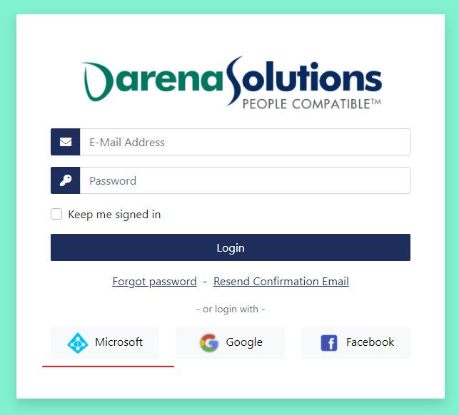

Azure Active Directory Users
============================
External authentication with Azure Active Directory is supported. Simply click on the ``Azure Active
Directory Login`` button.

Registering Your Organization
-----------------------------
Before you or any users in your organization can login, the organization must first be registered into
our system. Only users that are global/company administrators of the organization can begin the process.
We determine this by checking the "Global administrator" built-in role in Azure Active Directory.

.. image:: _images/aad-global-admin-role.png

This role should be applied by default to the user that first created the directory. A user with this
role must login by clicking the ``Azure Active Directory Login`` button. Once the user has logged in the
browser will be redirected back to our system. Our system will determine from the login that an organization
has not yet been created. This will redirect the browser to the organization registration form. The
form will be pre-populated with various information including the name, phone, and address details.
The user information will also be displayed.

.. important::
   Special attention is required for the ``Auto Activation Groups`` section. Please read
   the :ref:`auto-activation-groups` section to learn more

Completing Organization Registration
------------------------------------
Once all information has been entered for the organization, click on the ``Register`` button. This will
generate a request that a member of Darena Solutions will review. Until this request is approved by
a member of Darena Solutions, you and any users in your organization cannot login.

Once the request is approved, you will receive an email indicating so. No further action is required.
At this point, you should now be able to login using your Azure Active Directory credentials.

.. _auto-activation-groups:

Auto Activation Groups
----------------------
Once your organization is registered, other users in your organization should be able to login. However,
because of security reasons, we do not allow just any user in your organization to login. This is to
prevent unnecessary access to our products for users that should not have this access. At the same time,
we don't want every authorized user in your organization to go through an approval process. To make
this as easy as possible, we allow users in your organization to login as long as they belong to a specific
group.

Because groups in Azure Active Directory can be named in a free-form style and there aren't any "built-in"
groups, you must specify a list of groups that our application can check to determine that the user
logging in belongs to at least one of those groups. If the user does belong to at least one of the listed
groups, they are logged in without any other hassle. If they do not, an error message is displayed to
the user describing why they cannot login.

As an example, suppose you add the following list of groups in the ``Auto Activation Groups`` section::

    Administrators
    IT Personnel
    Application Members

What this tells our system is that if any user that is logging in belongs to *either*, ``Administrators``,
``IT Personnel``, or ``Application Members``, the user will be approved and is logged in.

.. note::
   This check is not performed again after the first time our system approves the login for a user.
   This means that if the user is removed from the group at a future time, the user can still login.
   Currently, there are no plans to change this default behavior.

Separate Profiles
-----------------
When you successfully login to our system using your Azure Active Directory credentials, we create a
profile for you in our own system. This profile is completely separate from the profile you have in
Azure Active Directory. Currently, these profiles are not in sync. If you change any details about your
profile in Azure Active Directory (such as your first name), it will not be reflected in our system's
profile. All of our products will still display your old first name.

To update the profile in our system, you will need to navigate to `<https://identity-manager.darenasolutions.com>`_.

.. note::
   Syncing of these profiles is currently being worked on. Please `click here <https://github.com/darena-solutions/bluebuttonpro-public/issues/1>`_
   to keep up-to-date on the issue.