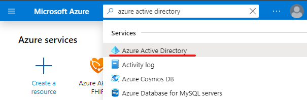
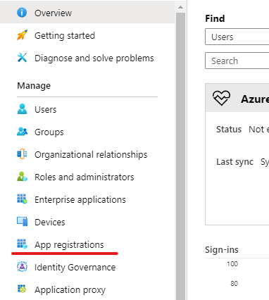
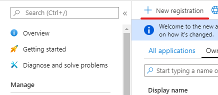
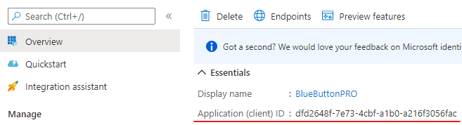
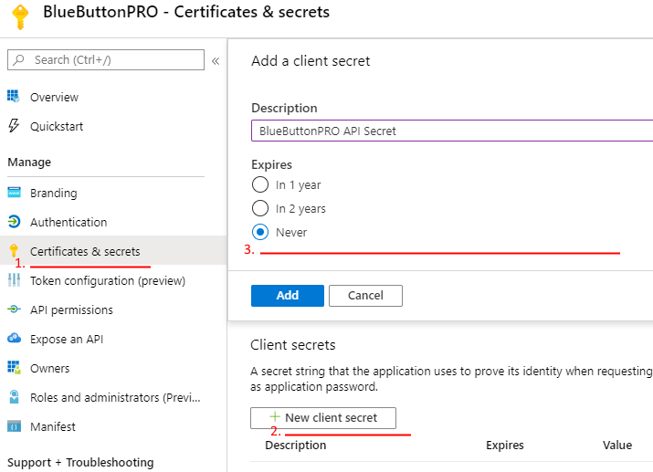
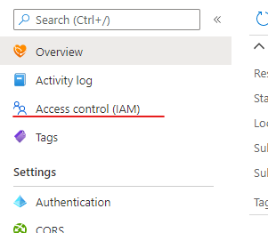
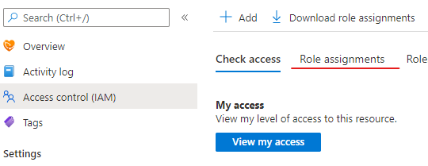
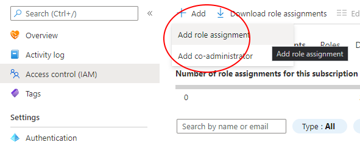
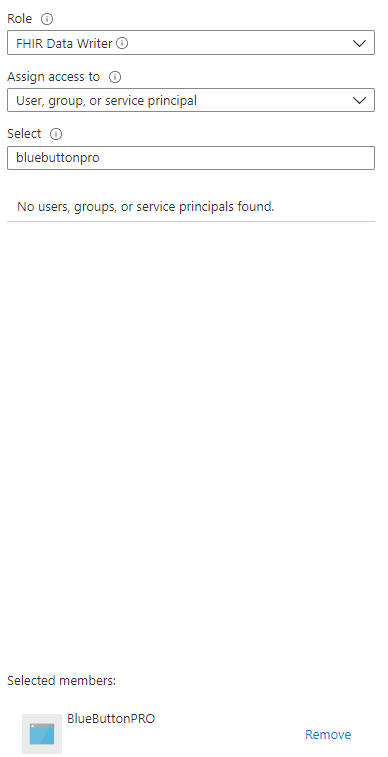

Azure API for FHIR
==================

If you already have an Azure API for FHIR instance, you can use this FHIR server with BlueButtonPRO.
You will need to link this server with our system. Our application then proceeds to generate an access
token by using the ``client_credentials`` flow to communicate with the server.

.. note::
   This guide assumes an Azure API for FHIR instance has already been provisioned and is ready for use
   in your Azure portal.

Before continuing, ensure that you have reviewed the :doc:`getting-started` guide and that you have
a client application ready for use that can request access tokens for our platform. This will be required
later to configure your Azure FHIR server with BlueButtonPRO.

Azure Portal Configuration
--------------------------

To set this up, go to your Azure portal by navigating to `<https://portal.azure.com>`_. Once there, search
for the resource **Azure Active Directory**:

Next, click on **App registrations** on the navigation page to the left:

Click on **New Registration**

.. _azure-api-linking-application-name:

In the next page, provide a name for this application, such as "BlueButtonPRO". You can leave everything
else as default. Once done, click on the **Register** button.

.. _azure-api-linking-client-id-take-note:

Once completed, take note of the client id as you will need to supply this value to BlueButtonPRO later:

.. _azure-api-linking-client-secret:

Next, you will be setting up the client credentials. Click on the **Certificates & secrets** item in
the navigation pane on the left. Then at the bottom, click on **+ New client secret**. A popup window
should appear. Enter in a description for this secret, such as "BlueButtonPRO API Secret". Set the expiration
to **Never**. This is how it should look like at this point:

Once done, click on the **Add** button. At this point, copy the secret value as it will not be displayed
in its entirety again. Store this somewhere for now as it will be needed later.

.. note::
   You may set the expiration to a different time other than **Never**. However, this means that you
   must update the client secret in the BlueButtonPRO application once the secret expries. Review the
   section, :ref:`bluebuttonpro-configuration`, to understand how to update the Azure API for FHIR details
   in BlueButtonPRO.

.. _azure-api-linking-rbac-setup:

Navigate to your Azure API for FHIR instance. This can be done by searching for "azure for fhir api"
in the search box at the top of the screen. Once your instance has been selected, click on the **Access control (IAM)**
item on the navigation pane to the left:

Click on the **Role assignments** tab:

Click on the **Add** button at the top of the section and then click on **Add role assignment**:

A pane should have opened up to the right. For the **Role** section, at this time we require the **FHIR
Data Writer** role only. It should not be too far down the drop down list, but you can always search
for this in the search bar. For **Assign access to**, keep this as the default value of **User, group,
or service principal**. In the **Select** section, search for the name of the :ref:`application you registered
<azure-api-linking-application-name>`. In this documentation, the application was named **BlueButtonPRO**.
Once the application shows up in the search result list, make sure you click on this application so
that it comes below down to the **Selected members** section. This is how the pane should look like
at this point:

Once completed, click on the **Save** button.

.. note::   
   From `Microsoft's documentation <https://docs.microsoft.com/en-us/azure/role-based-access-control/troubleshooting#role-assignment-changes-are-not-being-detected>`_,
   it can take up to 30 minutes before these changes take effect.

.. _azure-api-linking-endpoint-take-note:

That should be all the setup that is needed on the Azure side. Now we need to just note down a few more
things. Navigate to the **Overview** item in the navigation pane. Take note of the **FHIR metadata endpoint**.
This is the location of your FHIR server (without the ``/metadata`` at the end). Keep note of this endpoint
as you will need to supply this to BlueButtonPRO in the next section.

Click on the **Authentication** item in the navigation pane. Ensure that the **Audience** value is the
same as your FHIR server endpoint (without the ``/metadata`` at the end).

.. _bluebuttonpro-configuration:

BlueButtonPRO Configuration
---------------------------
Once the configuration is complete on the Azure Portal side, this information now needs to be entered
into BlueButtonPRO. Before starting this section, ensure that you have registered your organization
into our system. If you haven't done so, please review :ref:`azure-active-directory-users`. Additionally,
the client application that will be used to request access tokens for our platform must also have been
registered. Review the :doc:`getting-started` guide to learn more.

Obtain an access token with your client by logging in with your Azure Active Directory credentials.
The endpoint to configure your FHIR server is https://api.bluebuttonpro.com/FhirServers/aadfhirrecord.
This endpoint accepts the following parameters:

description
   A small description for the FHIR server. We recommend setting this value to be the name of your organization.

fhirDatabaseDisplayName - **REQUIRED**
   A URL supported display name for your FHIR server. This will be a unique value that identifiers your
   FHIR server. Once again, we recommend setting this value to be something that represents your organization.
   As an example, if your organization was named Good Health Clinic, you may want your display name
   to be **good-health-clinic**. Using this value, your FHIR server is now located on https://api.bluebuttonpro.com/good-health-clinic.
   You can make regular FHIR calls at this location. However, with Azure FHIR servers, there are some
   differences and limitations when compared to BlueButtonPRO FHIR servers. Please review :ref:`azure-api-linking-limitations`
   for more information.

fhirServerEndpoint - **REQUIRED**
   This is the location of your FHIR server. You should have noted this down :ref:`here <azure-api-linking-endpoint-take-note>`.

clientId - **REQUIRED**
   This is the :ref:`id of the client you registered <azure-api-linking-client-id-take-note>` in Azure
   Active Directory.

clientSecret - **REQUIRED**
   This is the :ref:`client secret that you setup in Azure Active Directory <azure-api-linking-client-secret>`.
   
Once you have all this information available, the following request can be made:

.. code-block:: console

   POST https://api.bluebuttonpro.com/FhirServers/aadfhirrecord

   Authorization: Bearer <token>
   Content-Type: application/json

   {
      "description": "Good Health Clinic",
      "fhirDatabaseDisplayName": "good-health-clinic",
      "fhirServerEndpoint": "https://goodhealthclinic.azurehealthcareapis.com",
      "clientId": "dfd2648f-7e73-4cbf-a1b0-a216f3056fac",
      "clientSecret": "my-client-secret"
   }

Once this request is sent, our API will validate this information. A small request will be made to the
FHIR server by using the client credentials that were supplied to ensure that our API can communicate
with the FHIR server without issues. If there were any errors along the way, our API will return a 400
bad request with a message indicating the nature of the error. If the error message is stating that
you should review your RBAC setup, note that it can take up to 30 minutes for role-based authentication
to take effect. If after 30 minutes you are still receiving this error, please contact our support team.
The role-based authentication was :ref:`setup here <azure-api-linking-rbac-setup>` for reference.

Your Azure FHIR server can now be used with BlueButtonPRO, although in limited capacity. Please review
the :ref:`azure-api-linking-limitations` section for more information.

.. _azure-api-linking-limitations:

Limitations
-----------

There are various differences and limitations when comparing Azure FHIR servers and BlueButtonPRO FHIR
servers. Please review the following before using our platform:

* Our API acts as a pass-through API. When a FHIR call is being made in our API, the request is being
  forwarded to the Azure FHIR server. Because of this design, the range of features and functionality
  will be different between Azure FHIR servers and BlueButtonPRO FHIR servers. It is possible that some
  features (search parameters, REST functionality, operations, etc.) are available for BlueButtonPRO
  and not for Azure and vice-versa.

* All `FHIR calls <https://www.hl7.org/fhir/http.html>`_ that are supported by BlueButtonPRO servers
  are also supported for Azure FHIR servers since they are forwarded to Azure. However, some things
  may not be supported by Azure. One such example is bundle transactions. Bundle transactions are fully
  supported by BlueButtonPRO, but this is not supported by Azure.

* When using the metadata FHIR endpoint, ``/metadata``, we return the metadata that is returned by Azure.
  This is not the same metadata that will be returned if using a BlueButtonPRO FHIR server.

* Similarly to how we forward each FHIR call, we also respond with Azure's response. This means that
  there may be some scenarios where the response will be different when compared to a BlueButtonPRO
  FHIR server. As an example, typically in a BlueButtonPRO FHIR server, if something isn't supported
  an unsupported operation outcome will be returned. When using an Azure FHIR server, the same response
  is not guaranteed because the Azure FHIR server will receive the call and respond with its own interpretation.

* SMART-on-FHIR is not supported.

* `Bulk export <https://hl7.org/fhir/uv/bulkdata/index.html>`_ is not supported.

* Sending :doc:`invites <invite>` and linking patients is supported.

* Sending, receiving, and importing :doc:`synapse packages <synapse>` is supported.

* Any other operation with BlueButtonPRO is not expected to be supported (EG: There is no support for
  importing resources or uploading CCDA's). If there is a specific functionality that is desired, please
  create an issue in our `github repo <https://github.com/darena-solutions/bluebuttonpro-public>`_.