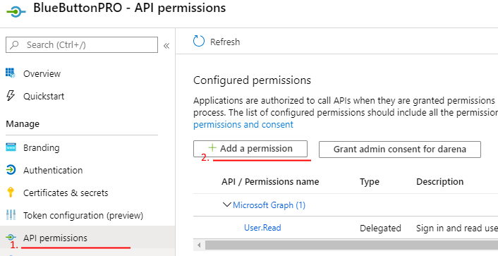
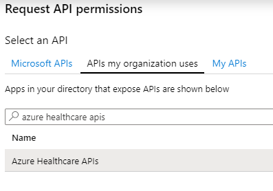
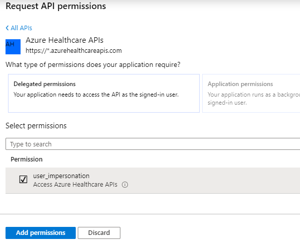
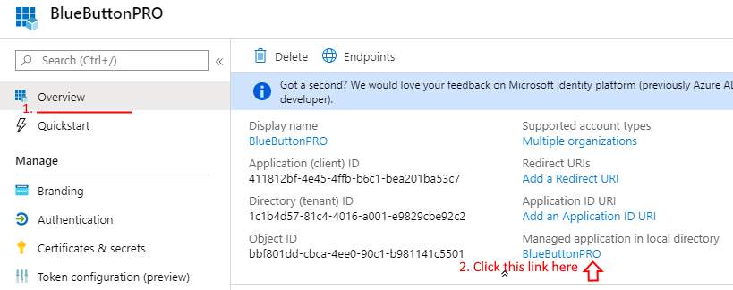
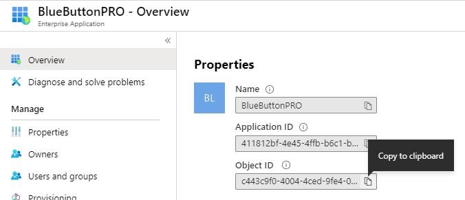
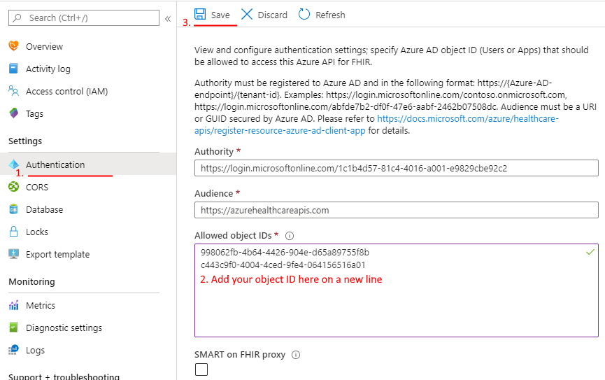
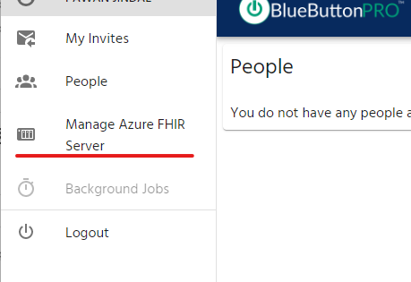
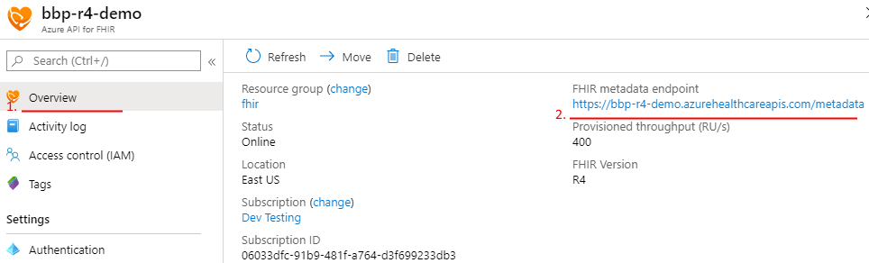

Azure API for FHIR
==================

If you already have an Azure API for FHIR instance, you can use this FHIR server with BlueButtonPRO.
You will need to link this server with our system. Our application then proceeds to generate an access
token by using the ``client_credentials`` flow to communicate with the server.

.. note::
   This guide assumes an Azure API for FHIR instance has already been provisioned and is ready for use
   in your Azure portal.

Azure Portal Configuration
--------------------------

To set this up, go to your Azure portal by navigating to `<https://portal.azure.com>`_. Once there, search
for the resource **Azure Active Directory**:

.. image:: _images/aad-search-aad-resource.png

Next, click on **App registrations** on the navigation page to the left:

.. image:: _images/aad-app-registration-nav-pane.png

Click on **New Registration**

.. image:: _images/aad-app-registration-new.png

In the next page, provide a name for this application, such as "BlueButtonPRO". You can leave everything
else as default. Once done, click on the **Register** button.

Once the application has been created, click on the **API permissions** item in the navigation pane
on the left. Click on **Add a permission**. Select the **APIs my organization uses** tab. Search for
"azure healthcare apis". Select the **user_impersonation** permission. Finally, click on **Add permissions**
to add this permission for the application.

You will be setting up the client credentials next. Click on the **Certificates & secrets** item in
the navigation pane on the left. Then at the bottom, click on **+ New client secret**. A popup window
should appear. Enter in a description for this secret, such as "BlueButtonPRO API Secret". Set the expiration
to **Never**. This is how it should look like at this point:

.. image:: _images/aad-app-registration-new-secret.png

Once done, click on the **Add** button. At this point, copy the secret value as it will not be displayed
in its entirety again. Store this somewhere for now as it will be needed later.

.. note::
   You may set the expiration to a different time other than **Never**. However, this means that you
   must update the client secret in the BlueButtonPRO application once the secret expries. Review the
   section, :ref:`bluebuttonpro-configuration`, to understand how to update the Azure API for FHIR details
   in BlueButtonPRO.

There are two additional pieces of information you will need to retrieve. Click on the **Overview** item
on the navigation pane to the left. Click on the link under **Managed application in local directory**:

On the new screen, copy the **Object ID** and **Application ID** and store it somewhere as it will be
needed later:

Navigate to your Azure API for FHIR instance. This can be done by searching for "azure for fhir api"
in the search box at the top of the screen. Once your instance has been selected, click on the **Authentication**
item on the navigation pane to the left. In the **Allowed object IDs** section, enter in the object
ID of the new registered application that you saved earlier on a new line. Then click on **Save** and
wait for the update to complete (this can take several minutes). Ensure that the **Audience** value
is set to ``https://azurehealthcareapis.com``, which is the default. The **Authority** value should
also remain the default:

.. _bluebuttonpro-configuration:

BlueButtonPRO Configuration
---------------------------
Once the configuration is complete on the Azure Portal side, this information now needs to be entered
into BlueButtonPRO. Before starting this section, ensure that you have registered your organization
into our system. If you haven't done so, please review :ref:`azure-active-directory-users`.

Navigate to `<https://app.bluebuttonpro.com>`_. Login with your Azure Active Directory credentials.
Select the **Manage FHIR Server** item on the navigation pane to the left:

In the next screen, we will need a few pieces of information.

Customized URL
   This is the URL that other users of the application will see when they want to send you data. This
   uniquely identifies your FHIR server in our system.

Description
   Provide a helpful description. We recommend setting the description to your organization's name.
   This description is displayed on the very top left of the screen, right below your account name.

FHIR Server URL
   This is the URL to the physical FHIR server provisioned in Azure. You can view this in the **Overview**
   item in the navigation pane. The endpoint is listed under **FHIR metadata endpoint**.

.. important::
   Make sure to remove the ``/metadata`` portion from the URL.

Client ID
   This is the application id of the new application you registered in the Azure portal. If you were
   following this guide, you should have this stored somewhere.

Client Secret
   This is the client secret of the new application you registered in the Azure portal. If you were
   following this guide, you should have this stored somewhere.

All fields are required.

Click on **Save**. Our application will take the information you provided and try to perform a small
request to the FHIR server to ensure everything is in order.

If everything was successful then that should be it. Our system is now linked to your existing Azure
API for FHIR instance!
